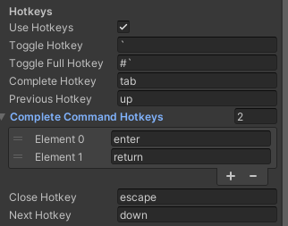
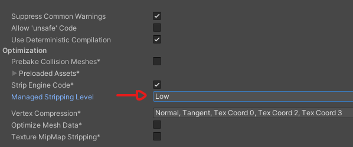
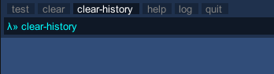

Unity Command Terminal
======================

# Notice

This is a fork of [Command Terminal](https://github.com/stillwwater/command_terminal) for Unity, mainly to address usability gaps and add maintenance

# To Install as Unity Package
1. Open Unity Package Manager
2. (Optional) Enable Pre-release packages to get the latest, cutting-edge builds
3. Open the Advanced Package Settings
4. Add an entry for a new "Scoped Registry"
    - Name: `NPM`
    - URL: `https://registry.npmjs.org`
    - Scope(s): `com.wallstop-studios.dxcommandterminal`
5. Resolve the latest `com.wallstop-studios.dxcommandterminal`

## Improvements Over Baseline
- [Enhanced Auto-Complete + Hint system + styling](#hints)
- Fixed Input handling bugs related to [WebGL](#web-gl)
- Fully integrated with Unity's [new Input System](#new-input-system)
- Fully [configurable and bindable controls](#hotkeys) for every action
- Add ability to ignore commands that have been annotated with `RegisterCommandAttribute`. In this way, your terminals can ignore any built-in commands, for cleanliness. A custom editor has been added to provide users with the ability to identify what commands are available to ignore, and selectively ignore them.
- Add ability to ignore certain (or all) log levels, such that unwanted logs do not clutter terminal output
- Add ability to optionally have Unity log messages routed to the terminal, default on, but can be turned off
- Add ability to optionally ignore all default commands, such that you can write your own commands that conflict with the default provided ones, such as `HELP`, `TIME`, etc
- CommandArg value parsing has been overhauled. Instead of specific properties like `Float` and `Int` that always return a value, regardless of if parsing succeeded or not, a singular `bool TryGet<T>(out T parsed)` method is supplied. This method provides robust parsing for all common types and has the ability to take in user-specified custom parsers for any fancy logic. See [Custom Parsing](#custom-parsing) for details.
- CommandArgs can now have arguments with spaces passed to them, similar to how real terminals work. Any string values surrounded by single or double quotes will be interpreted as a single input (including spaces within those quotes). Single quotes must match single quotes and double quotes must match double quotes. If there is an unmatched (hanging) quote, the entire rest of the input will be interpreted as the command argument value.
- Dynamic console resizing when Screen Size change is detected, implemented in a very performant fashion
- Added Assembly Definitions, so that this project can be used cleanly in projects that utilize Assembly Definitions
- Fixed a bug where commands annotated with `RegisterCommandAttribute` in other assemblies failed to be recognized. User assemblies have higher precedence.
- Fixed a bug where only the latest error message was preserved - errors are now queued
- Fixed a bug where attempting to access static `Terminal` properties would throw if the Terminal had been enabled yet.
- Fixed a bug where moving through command history did not update the cursor position
- Fixed a bug where enabling and disabling the Terminal would break AutoComplete
- Fixed a bug where you could interact with the terminal when it was in closed state
- Fixed a bug where commands run programmatically were not added to history
- Fixed a bug where terminal line height was not being calculated correctly
- Fixed a bug where input caret width was not being calculated correctly. Previously, long caret strings would be rendered improperly
- Unified behavior around navigating up and down through command history. Previously, navigating up as far as possible would "stick" to the up-most command, while navigating down as far as possible would result in a "blank" command. Now, walking past either end of up/down results in a blank command.
- History is now filterable by execution success (command existence) as well as error status of the command
- Minor performance benefits if there are terminals in multiple scenes
- Minor performance benefits (O(n) -> O(1)) when the terminal buffer becomes full
- Minor performance benefits around multiple-indexing into dictionary issues
- Minor performance benefits around using string interpolation and intelligent checking of parameters to only force `string.Format` when relevant in logging paths
- Better invalid command identification and error messages
- All string comparisons are now `OrdinalIgnoreCase` instead of relying on CurrentCulture
- `Terminal` has been made to be Editor-Change-Aware. If the Editor is in Play mode, changes to the current terminal properties will take effect immediately.
- Extra input validation has been added on all public methods, such that user code is sanitized where appropriate, or rejected if invalid.
- The concept of "FrontCommands" has been exterminated

## Code changes
- All code is formatted via [Csharpier](https://csharpier.com/)
- All variables are now consistently named
- Access modifiers have been explicitly applied to every field
- All warnings have been gotten rid of
- Collections / properties are now exposed as immutable by default. Mutable fields / properties are only exposed as necessary
- Conversion to capitalization/lowercase is now only done where absolutely required
- Annotated all logging methods with Jetbrain's `StringFormatMethod` attribute to aid in intellisense and help identify formatting issues
- All classes / structs have been made sealed / readonly where possible to promote immutability
- Validation around command ignoring and log level ignoring has been added to Terminal, to prevent invalid data

## The Future
More improvements coming soon, stick around :)

Planned improvements:
- Command Groups
- Background not being rendered bug
- Ensure working in Mobile builds
- Smarter auto complete
- Ensure HTML color coding works

---

A simple and highly performant in-game drop down Console.


Command Terminal is based on [an implementation by Jonathan Blow](https://youtu.be/N2UdveBwWY4) done in the Jai programming language.

## Usage

Copy the contents from [CommandTerminal](./CommandTerminal) to your Assets folder. Attach a `Terminal` Component to a game object. The console window can be toggled with a hotkey (default is backtick), and another hotkey can be used to toggle the full size window (default is shift+backtick).

Enter `help` in the console to view all available commands, use the up and down arrow keys to traverse the command history, and the tab key to autocomplete commands.

## Registering Commands

There are 3 options to register commands to be used in the Command Terminal.

### 1. Using the RegisterCommand attribute:

The command method must be static (public or non-public).

```csharp
[RegisterCommand(Help = "Adds 2 numbers", MinArgCount = 2, MaxArgCount = 2)]
static void CommandAdd(CommandArg[] args) {
    int a = args[0].Int;
    int b = args[1].Int;

    if (Terminal.IssuedError) return; // Error will be handled by Terminal

    int result = a + b;
    Terminal.Log("{0} + {1} = {2}", a, b, result);
}
```
`MinArgCount` and `MaxArgCount` allows the Command Interpreter to issue an error if arguments have been passed incorrectly, this way you can index the `CommandArg` array, knowing the array will have the correct size.

In this case the command name (`add`) will be inferred from the method name, you can override this by setting `Name` in `RegisterCommand`.

```csharp
[RegisterCommand(Name = "MyAdd", Help = "Adds 2 numbers", MinArgCount = 2, MaxArgCount = 2)]
```

### 2. Using a FrontCommand method:

Here you still use the `RegisterCommand` attribute, but the arguments are handled in a separate method, prefixed with `FrontCommand`. This way, `MaxArgCount` and `MinArgCount` are automatically inferred.

This also allows you to keep the argument handling `FrontCommand` methods in another file, or even generate them procedurally during a pre-build.

```csharp
[RegisterCommand(Help = "Adds 2 numbers")]
static void CommandAdd(int a, int b) {
    int result = a + b;
    Terminal.Log("{0} + {1} = {2}", a, b, result);
}

static void FrontCommandAdd(CommandArg[] args) {
    int a = args[0].Int;
    int b = args[1].Int;

    if (Terminal.IssuedError) return;

    CommandAdd(a, b);
}
```

### 3. Manually adding Commands:

`RegisterCommand` only works for static methods. If you want to use a non-static method, you may add the command manually.

```csharp
Terminal.Shell.AddCommand("add", CommandAdd, 2, 2, "Adds 2 numbers");
```

---

# Custom Parsing
One change from the original Command Parser is the usage / functionality exposed for parsing the parameters to the CommandArgs themselves. The original library exposed four methods for retrieving arguments - `String`, `Float`, `Int`, and `bool`. If the input was invalid, these parsing methods would simply return the default value and log an error, making it very difficult to programmatically react to bad input.

To remedy this, DxCommandTerminal exposes two methods - `String` and `TryGet`. `String` returns the original input parameters as-is. `TryGet` attempts to parse the provided input parameter as the given type, taking in an optional parser. You can also register and deregister parsers for any type, which will override the built-in ones, making use of whatever custom logic you want (JSON, for example).

```csharp
public bool TryGet<T>(out T parsed);
```

Sample usage:

```csharp
CommandArg arg = new CommandArg("1");
Assert.IsTrue(arg.TryGet(out int parsedInt)); // 1
Assert.IsTrue(arg.TryGet(out double parsedDouble)); // 1.0d
Assert.IsTrue(arg.TryGet(out float parsedFloat)); // 1.0f
Assert.IsTrue(arg.TryGet(out char parsedChar)); // '1'

Assert.IsFalse(arg.TryGet(out Vector2 invalidVector2)); // Failed to parse
Assert.IsFalse(arg.TryGet(out Color invalidColor)); // Failed to parse

arg = new CommandArg("red");
Assert.IsTrue(arg.TryGet(out Color color)); // Color.red
Assert.IsFalse(arg.TryGet(out int invalidInt)); // Failed to parse
```

`TryGet<T>` supports the following types out of the box:
- string
- char
- bool
- float
- double
- decimal
- int
- uint
- long
- ulong
- short
- ushort
- byte
- sbyte
- Guid
- DateTime
- DateTimeOffset
- Enums

**Unity Types**:
- Vector2
- Vector3
- Vector4
- Quaternion
- Vector2Int
- Vector3Int
- Rect
- RectInt
- Color

In addition to parsing values directly, `TryGet` will automatically attempt to match `public static` or `public const` named fields. For example, all of the following will parse as doubles:

- "1.2"
- "MaxValue"
- "MinValue"

Similarly, for Colors:
- "RGBA(0.7, 0.5, 0.1, 1.0)"
- "(0.7, 0.5, 0.1, 1.0)"
- "(0.7, 0.5, 0.1)"
- "red"
- "clear"

For all built-in types, the parsers are guaranteed to work with the type's default `ToString()` implementation, as well as logical versions of the data structure. See `Color` sample parsable inputs for an example of this.

If you would like to have built-in parsers for a type that is not listed above, please open an issue!

## Advanced Parsing - Custom Parsers
`TryGet<T>` has an overload that takes a nullable `CommandArgParser<T>`, which is a function with the following definition:

```csharp
bool CustomParser<T>(string input, out T value);
```

If a custom parser is provided, it will be used instead of any of the built in parsing functions. Please note that, as input, if the type is not in the `DoNotCleanTypes` set, the function will be provided with a cleaned version of the input string.

```csharp
// Somewhere
public static bool AlwaysParseIntAs32(string input, out int value)
{
    // Ignore input, always parse as 32
    value = 32;
    return true;
}

// Usage
CommandArg arg = new CommandArg("SomeInput");
Assert.IsTrue(arg.TryGet(out int value, AlwaysParseIntAs32)); // 32
Assert.IsFalse(arg.TryGet(out float invalidFloat)); // Failed to parse
Assert.IsFalse(arg.TryGet(out Color invalidColor)); // Failed to parse
```

If a parsing function is common enough, it can be registered via:

```csharp
bool CommandArgParser.RegisterParser<T>(CommandArgParser<T> parser, bool force);
```

This function will return true if the parser was registered successfully. You can provide an optional `force` flag to override any pre-existing registered parsers for that type.

Parsers registered in this way will be used instead of any built-in parsing functions.

Parsers can be unregistered via:

```csharp
bool CommandArgParser.UnregisterParser<T>();
```

or

```csharp
bool CommandArgParser.UnregisterParser(Type parserType);
```

or even

```csharp
int CommandArgParser.UnregisterAllParsers();
```

All of these unregistration functions will return you information on whether the unregistration functions were successful. 

Note: Built in parser functions cannot be unregistered.

## Advanced Parsing - Changing Control Sets
By default, command parameter input is stripped of whitespace characters. This, along with several other parsing-specific behaviors, are controlled via public static sets on `CommandArg` itself. If you would like to change this behavior in your code, you can modify the contents of these sets to be whatever you'd like. Below are a description of the sets and what they control.

**Delimiters**: For complex, multi-value types like `Vector2`, `Quaternion`, `Color`, etc, the parameter is split using the first match, if any, found in this set. ie, `1,2,3` will get split into the array `["1", "2", "3"]` for parsing

**Quotes**: By default, parameter values are split using whitespace characters. ie, `mycommand 1 2` will call `mycommand` with the arguments `1` and `2`. Another augmentation of DxCommandTerminal is the ability to capture spaces, or any normally-ignored character as input, as long as they're surrounded by any of the characters found in the `Quotes` set. If there is a chunk of text that starts with a character found in the `Quotes` set, but has no matching terminating character, the input string from the first quote character to the end is considered as one parameter. For example, `my command "1 2"` will call `mycommand` with a single argument of `"1 2"`.

**IgnoredValuesForCleanedTypes**: For cleaned types, string sequences in this set will be replaced with the empty string.

**DoNotCleanTypes**: A set of types for which input cleaning is not enabled.

**IgnoredValuesForComplexTypes**: For complex, multi-value types like `Vector2`, `Quaternion`, `Color`, etc, the parameter input will replace all strings found in this set with the empty string.

# Hotkeys
All actions are now fully configurable by either explicit keybindings, for keyboard controls, or via [new Input System](#new-input-system) bindings.



Keyboard hotkey bindings are now intelligent as they can be about shift key interaction. There are three ways to create a `shift+<binding>`:
1. Prefix the binding with the `#` symbol. For example, `#tab` will be interpreted as `shift+tab`
2. For keys with shifted versions, such as alpha numeric keys, simply use the shifted version. For example, `A` will be interpreted as `shift+a`
3. When using the new input system, hotkeys can be represented as `shift+<binding>`. `shift+tab` will be interpreted as the combination `left shift` + `tab`.

The only combination keys that are supported without using custom bindings via the new Input System are `shift+<binding>`.

# New Input System
DxCommandTerminal is now fully integrated with Unity's new Input System, if it is found in the project and enabled. 

You can also use `PlayerInput` or similar to bind InputActions to all available command terminal behavior. The available message are:
- `HandlePrevious`: Selects the previously issued command form current command history location.
- `HandleNext`: Selects the next issued command from current command history location.
- `Close`: If the terminal is open, closes it.
- `ToggleSmall`: If the terminal is not opened to its small height, opens it to small height, otherwise closes it.
- `ToggleFull`: If the terminal is not opened to its full height, opens it to full height, otherwise closes it.
- `CompleteCommand`: Uses auto-complete to attempt to complete the current command using what is typed in the command buffer, cycling forwards through results.
- `ReverseCompleteCommand`: Uses auto-complete to attempt to complete the current command using what is typed in the command buffer, but cycling backwards through results.
- `EnterCommand`: Takes the current buffer and attempts to execute it as a command + parameters.

## Note
If using PlayerInput to bind to the above controls, you will need to uncheck `Use Hotkeys` under the `Hotkeys` header in the Terminal script.

When InputActions are not bound, there is an order of precedence for input checking. It is:
- Close
- Enter Command
- Previous
- Next
- Toggle Full Terminal
- Toggle Small Terminal
- Auto Complete (backward)
- Auto Complete (forward)

This order is irrelevant when using PlayerInput.

# Web GL
If you are relying on `RegisterCommandAttribute` to wire up your commands to the CommandShell instead of manually registering them, you will need to set `Managed Stripping Level` to `Low`, `Minimal`, or `None` under `Player > WebGL > Other Settings > Optimizations > Managed Stripping Level` in order for command registration to work. Settings of `Medium` or higher will break the reflection code that loads the commands, causing the terminal to forget about its capabilities.



See [Unity docs on Managed Stripping Level](https://docs.unity3d.com/2022.3/Documentation/ScriptReference/ManagedStrippingLevel.html) for more details.

# Hints
AutoComplete has gotten a major upgrade in this fork. Completion is now not only case-insensitive, but it will now also search (unique) commands that have been executed, ignoring any irrelevant input. Pressing the complete key multiple times now selects available options in a persistent fashion. Completion can be walked both forward and backwards. Results are now presented in a new UI that intelligently adapts to screen space and current selection position. When completion is no longer relevant, the UI is disabled. However, you can opt to always show the available commands by toggling the new `Display Hints` option in the Terminal configuration. There are also several new theming options for hints, with controls over the currently selected hint v unselected hints.

